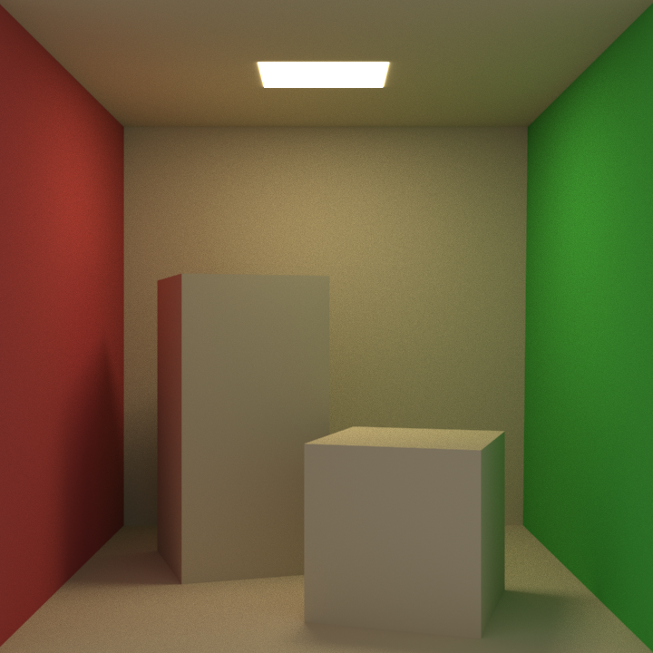

# Piz

A simple software renderer 

## Build 

Cross-platform is planned but not implemented yet. Currently only `win32` is supported. Use cmake to build.  

## Demo_Interactive 

A simple software rasterizer with real time keyboard interaction (WASD). 

## Demo_PathTracer 

Path tracer that uses only backward tracing. Two scenes are implemented (see scene.cpp).

